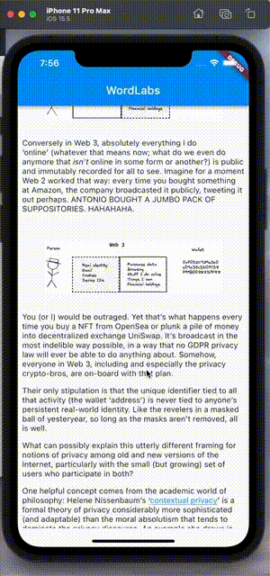
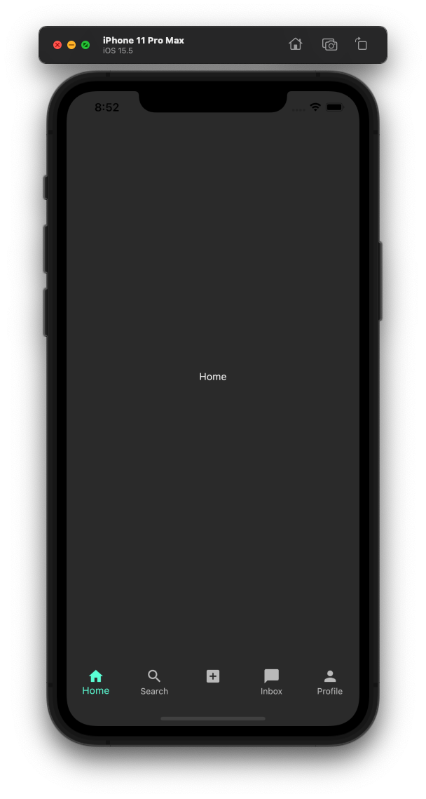

As you can see in the following GIF, I was able to display a simple blog post in the app I've created:

I also followed some awesome YouTube videos and started to create the UI for my app.

## Sources

- [TIK TOK • FLUTTER UI FROM SCRATCH](https://www.youtube.com/watch?v=5ioMuy0H_Ks)
- [Build Full Stack Tiktok Clone | Flutter | Firebase | GetX](https://www.youtube.com/watch?v=4E4V9F3cbp4)

{}
