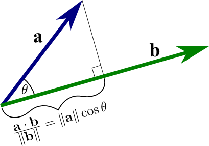

As 2020 wraps up, I think it is a good time to reflect and look forward a bit to what has made me happiest and feeling most successful.
If I have learned anything this year, it is that there are things you can control, and things you cannot control.
One of the most powerful things you can control is what you allow into your life.  

This post is meant to be a whirlwind introduction to my thoughts on success and the practical philosophy I am developing.
Of course, nobody has the one answer and entire libraries can be written on the topic, but I thought it might be helpful for me to share my thoughts on the matter.

This post is partially inspired by Nietzche's book, Thus Spoke Zarathustra [^3].
The book is covers this topic and more and has a lot of great content on the subject, so if you are interested I definitely recommend checking it out.
I will use ideas from the book to define what I mean by "success" in this context.

## Core Concepts

When I started reading Thus Spoke Zarathustra, I came across an exceptionally profound question that granted me a valuable paradigm in which I began to formulate this philosophy.
The question is a thought experiment that has to do with Nietzche's concept of Eternal Recurrence.

### Eternal Recurrence

Imagine that tonight a demon sneaks into your bedroom and poses a directive: you are to relive your life in the same way up until this point an infinite amount of times.
What is your reaction? Do you scream in terror at the thought of such a horrible task? Or does your face light up when you imagine all the pleasure you will have from each iteration?
The sad fact is that most of us live in the first camp.
However, now that we understand this question and our response to it, we can make steady progress towards the second camp.
Today my goal is to share a bit about my personal, practical philosophy/framework for getting there, and I frame it in terms of success.

### The Uberhuman

In the book, the main protagonist Zarathustra explains that humans are meant to be overcome.
He sees the Uberhuman as the actualization of the next evolution in man as a higher state of being.
This is represented in popular culture by the baby at the end of Stanley Kubrik's 2001: A Space Odyssey.

By Nietzche's definition, a true Uberhuman has likely not been born yet, and if they do exist, they are infrequent and most people would not even know how to recognize one.
If you are reading this, then you are unfortunately more human than Uberhuman due to the imperfections (such as trauma) that naturally come in as you lead an everyday life.

In practical terms, we can think about this as self-actualization.
We all have an image of the best versions of ourselves and what we want our lives to look like.
My view of success is living in that space.
All of the elements in our lives are aligned in such a way that we live according to our highest selves.

To fully understand this picture, it is worthwhile to introduce two more critical concepts from the book.

### Will to Power

Will to power can be understood as the drive you have to become something.
It does not necessarily include power in the traditional sense but incapsulates everyth

Another way to put it would be living to the highest standard of our practical selves.
I think it is amazing that only a few things really matter to becoming the most robust, most capable, and best version of yourself.
It can be tempting to think of all the things in life that people want and how much of it is not available to us, but if we dig down and ask, "What would the best version of me have in spades?" I believe there are only three.
I call these the three dimensions of success.

## The Dimensions of Success

If you have too many virtues, you will become bogged down in having too many goals, and your direction will change constantly.
But, neglecting one or more of these crucial dimensions of success will leave your life seriously lacking.
As somebody who studied physics in college, I am a huge fan of simplicity and having only a few governing principles as arbitrary complexity can arise from only a few simple rules.

Harvard Professor Emeritus Howard H. Stevenson lists three aspects of success and says to think about them as balls to constantly juggle in his lecture on Building a Life [^2],
In his research on successful people, he found that the four areas that were most important to lifetime success were: happiness, significance, achievement, and legacy.
While the lecture is full of good content and worth a watch, I would like to propose a different set of dimensions for success that narrows down the list and makes it a bit clearer.

My three dimensions of success are: **career**, **relationships**, and **spirituality**.
Ideally, each one has a decreasing sphere of influence.
The way your success affects society is your career.
The way your success affects those close to you is in relationships.
The interaction of success with yourself is spirituality.

I am open to more empirical evidence to support or reject these.
But I believe you should be as *selfish* as possible for all things along these dimensions.
Nobody will make these happen for you; even if they could, you wouldn't want them to.
Without further ado, let's get started.

### Career

This one is our culture's most supported and well-understood dimension of success.
It is what we traditionally think of as "success" if we lazily bring up the term in our minds.
However, I define it more broadly as living up to your potential.

A career is all the things you "do" amounts to what impact you can have on the world.
What can you build? Who can you influence? These questions are answered and reflected by the strength of your career.

This is where achievement becomes a significant focus.
Money, power, status, and fame are symptoms of a great career.
But, they do not themselves define success.

Another way to think about this dimension would be to picture a patch of a forest.
Let's say you want to become a tree.
You are a stable person, think long term, and are helpful and support others, so you become a tree.
Now you can succeed in many ways in your career as a tree.

You can house generations of squirrels, birds, and other creatures. You can be the tallest tree in the forest or the most scenic.
But to succeed and be the best you can be, you must be honest with yourself that your role is to be a tree.

#### Career questions

Some questions you may want to ask yourself are:

* Am I good at what I do?
* Do I gain respect from people for my work? Do people value my work?
* Am I living up to my potential? Can I do more?

### Relationships

This domain is honestly the newest to me.
I was interested in improving this part of my life, but I also thought letting it happen naturally was okay.
It was a shock to me that people made an effort to keep relationships open with people outside of doing what feels good. Shocking, right?

Humans are social animals, and we almost all have a baseline level of sociability we must maintain for our health.
If anything, the pandemic has highlighted this fact for many people.

Your relationship health is a factor of how much of yourself you can give to others.
This can be anything from giving decades as a parent to providing half an hour to reach out to a friend on the phone, to even giving up your living situation to be with someone else.

I see success here as a multiplicative effect, which is in part due to Metcalfe's law.
Metcalfe's Law [^4] states that the strength of a network increases by the square of the number of users.
Originally applied to telecommunications, I like to extend this to quality of life and relationships.
Having several positive relationships in your life can often combine to make things drastically better for yourself.

Of course, there is a limit here due to our mortal nature. We, unfortunately, have mouths and eyes, not routers and modems for making connections.
Scientists have suggested that people tend to form roughly 100 to 150 groups.
Any more significant than that, the group tends to fracture into sub-groups and separate into a new group.

However, ignoring this area of success entirely is detrimental in several areas.
Most Americans can't even name a single close friend.
Building and maintaining this network takes a lot of effort. Still, one friend is so practically so much more than zero, and the benefits continue to increase as you add more relationships.

#### Relationship questions

Some associated questions would be:

* How many people love me?
* What kind of impact do I have on others?
* If you asked my friends about our relationship, what would they say? What about my parents, children, or my lovers?
* Are there people in my life that I can count on to be there for me and can count on me?

### Spirituality

I believe that this dimension of success is the least emphasized and least understood in our culture.
Spirituality does not necessarily mean religion, at least in how I use it.
One way to look at spirituality is as the dot product between what you want to be and what you are.

#### Spirituality questions

* Am I happy? Am I fulfilled by what I do and who I spend time with?
* Can I practice radical acceptance?
* Am I in touch with the natural world?

## Making a Measurement

The most difficult challenge in achieving success is honesty.
How many of us have thought things are going great when suddenly we get hit by a bout of depression, a prolonged job search, or a "dry spell"?
A frequent and honest evaluation of yourself along these three dimensions is crucial for success.

Of the three dimensions, the easiest to measure is the career by far.
The free market determines how successful a career you have.
As you might imagine, plenty of books are written on this subject.
If you are interested in learning more about building career success that also brings overall success in how we define it, I suggest checking out the book What You're Really Meant to Do by Robert Kaplan [^1].

The other two: relationships and spirituality are much more challenging to measure.
Unfortunately, we do not have a decentralized system with a currency filled with agents (the free market) to help us evaluate these two.
As much as some of us wished it were true, your number of Instagram followers does not measure the success of your relationships.
Similarly, just because you attend church twice a week does not make you a spiritually healthy person.

While we will not have the same accuracy as you in the free market, I sense that these last two can start to be measured by giving questionnaires similar to a personality test but with questions like the ones above.

## Helpful Resources

On this journey, there are several things that we can do to maximize our chances of achieving success.
Some people think these are ends, but they are tools you can use to support yourself in achieving success.
Here are some of the most effective tools for achieving success:

* Health - both mental and physical. Physical health is one of the most important factors for life satisfaction and well-being. Diet is huge. Also, go to therapy!
* Journaling - This can be an excellent time to evaluate yourself honestly or vent about life, as we discussed earlier.
* Meditation - Even 10 minutes a day helps you center yourself, calm the mental noise, and understand your thoughts more. I should be better about this one.
* Reading and learning - This one is not to be done lightly. It is ok to love learning, but there is also something to be said about deliberate learning. One piece of advice that I follow is if you lose interest in a book, move on to the next one. Life is too short to finish books that do not interest you.
* Personal Finance - Oh boy, I spent a lot of time reading about this. You can figure out enough to cover yourself in 90% of situations with just a day's worth of research. It works for me to figure out how to "set it and forget it" and not spend too much time finding the absolute lowest cost index fund and tracking every penny. Having this down dramatically increases the stability of your life, and that is what we are after here.

## Failure

We can't talk about success without bringing up the topic of failure.
Failure means you are pushing yourself and is nothing to be ashamed of.
It is worth saying that just because you fail does not make you a bad person or mean that you will not achieve success as we have defined here.

I think a healthier way to look at failure is to note what the intended outcome was, why you could not get there, and then make a note to revisit it in the future.
Ultimately our goal is to create a life where we have all the things we want, and of course, failure will come along for the ride.

<!-- modify this form HTML and place wherever you want your form -->
<form
  action="https://formspree.io/f/xwkadlba"
  method="POST"
>
  <label>
    Enter your email to subscribe for updates:
    <input type="email" name="email">
  </label>
  <!-- your other form fields go here -->
  <button type="submit">Send</button>
</form>

## Sources

[^1]: [What You're Really Meant to Do](https://www.goodreads.com/book/show/17624016-what-you-re-really-meant-to-do) - Robert Steven Kaplan
[^2]: [Building a Life](https://youtu.be/wLn28DrSF68) - Howard H. Stevenson
[^3]: [Thus Spoke Zarathustra](https://www.goodreads.com/book/show/51893.Thus_Spoke_Zarathustra?ac=1&from_search=true&qid=DtizlxsT4j&rank=1) - Friedrich Nietzche
[^4]: [Metcalfe's Law](https://en.wikipedia.org/wiki/Metcalfe%27s_law)
