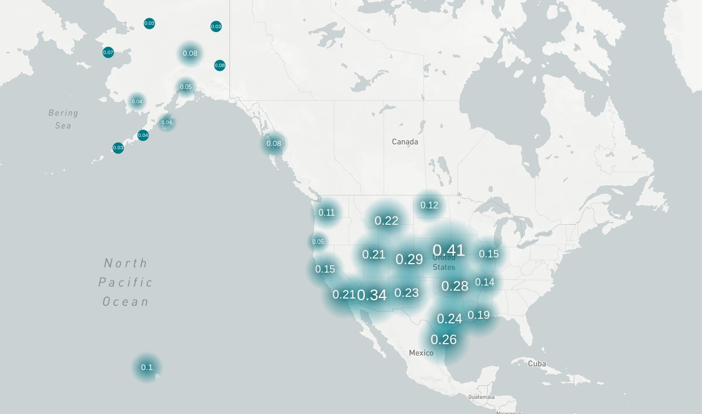
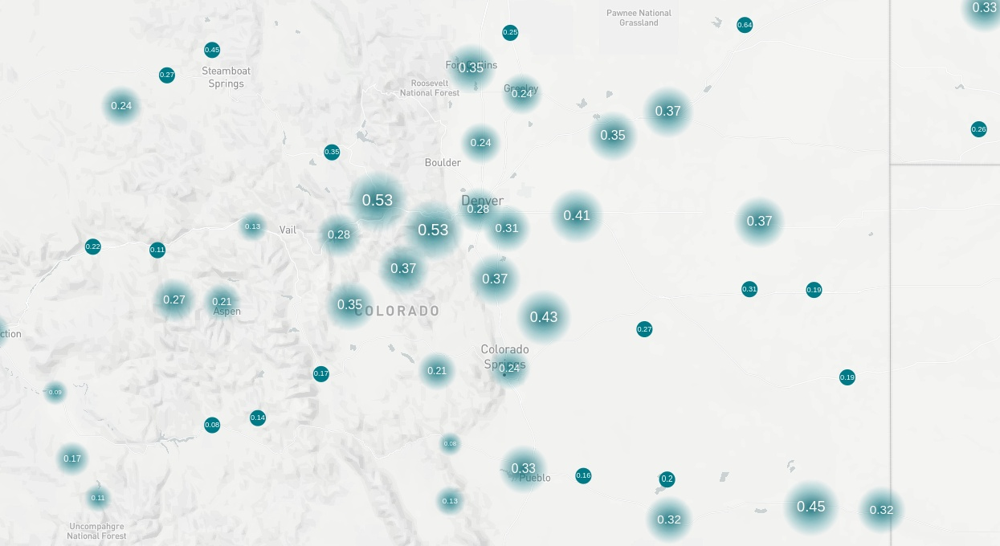

*Lessons learned from my first remote hackathon*

I just completed my second hackathon ever, and I learned so much. I have been working on the [AWS Data Exchange for APIs Challenge](https://awsdataexchange4apis.devpost.com/?ref_feature=challenge&ref_medium=homepage-recommended-hackathons) on Devpost since the 25th of October and have been [sharing](../../../daily/2022-10-25) my progress ever since. However, the hackathon ends tomorrow, and I need more to submit. I will share my biggest takeaways and what I would do differently next time so that we can both build cool projects.

### The skinny

In a 🥜 shell, here's what I will do differently next time:

1. Make an MVP that satisfies the competition requirements before you do anything else.
2. Be aware that you might not rank if you chase the new "shiny thing" that pops up. If you choose to learn something new - excellent - but you are handicapping yourself by not using the tools with which you are already comfortable.

#### What I learned

I got to play with [Meltano](../../../daily/2022-10-29.md), an exciting library to easily create and manage data pipelines, learn about [GIS data](../../../daily/2022-11-06.md), and fail upwards while [learning Dask](../../../daily/2022-11-18.md). I can confidently say I've learned a ton 📚.

The accomplishment I'm most proud of during this hackathon was creating a map of the highest-value areas to raise a family using Apache Superset. I used the [Opportunity Atlas](https://www.opportunityatlas.org/) dataset, a dataset of the average income for a 35-year-old born and raised in a geographic area within the United States. This dataset came out recently and made waves by showing something we all knew: the neighborhood you grow up in impacts your life outcomes.

I extended these numbers by dividing the "opportunity index" by the median housing cost from the [Zillow Home Value Index](https://www.zillow.com/research/data/) to get the "value" of living across the United States. The result was the following:

This visualization shows the mid-west is a promising area in terms of value for housing and economic opportunity. Unfortunately, this does not use any of the competition's data, so while this is great, I plan to leave this project to die on the vine and create this blog post instead.

### What I would've done differently

Since this was one of my first hackathons, I made crucial errors that I hope others can learn without making the same mistakes. As I said before, I believe I made two main errors while competing in this hackathon:

1. I spent too much time on the new "shiny" thing, Meltano and DuckDB. I spent seven days a week just noodling with these tools when I could've loaded the data into Apache Superset manually in a day or two.
2. I should have spent the competition on task. The competition's goal was to use APIs in AWS's Data Exchange. I only started looking into that in my second week after completing the above map.

On the first point: I believe hackathons are supposed to be fun and a learning experience, and if you want to use a new tool, then this could be an excellent opportunity to give it a shot. But I'll bet the people who win hackathons use tools they know well. I guess this is a hypothesis I may have to return to at a later date 🤔.

My code for this hackathon is available on my [Github](https://github.com/evanaze/awsdx-hackathon).

{}
